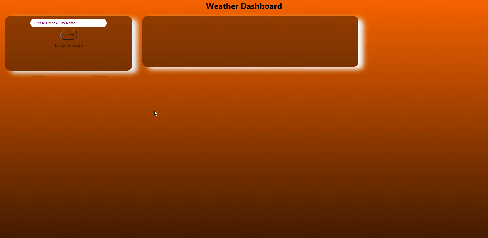

<h1 style="text-align: center;">Weather Dashboard</h1>

[[Deployed-Site]](https://jdogcrane.github.io/WeatherDashboard/)

[[Site-Preview]](#Site-Preview)

## General overview: 

 
This project was centered around a weather dashboard. The user can input a city and get weather data back. Data specificity the day the weather was forecasted. The weather that day, humidity level, temp and wind speed. The user is also provided a five day forecast I the future for the city specified.

<h3 style="text-align:center;">Instructions</h3>

1. Input your desired city for weather data.
2. Click submit button
3. Enjoy your city weather data and forecast!

<h3 style="text-align:center;">JS-Summary</h3>

* Added time and date for current day
* Added created a search function
* Added api for weather data
* Added variables to be changed based off user input in search
* Added added HTML to be created with the weather data
* Added data collection for current day

>Notes: I struggled to do this one under the small time frame I had. After my class ended I spent all the time I had working on this. I think I did alright considering the time frame I had. Wish I had more time, think I would of gotten all the features in...

## Site Preview
